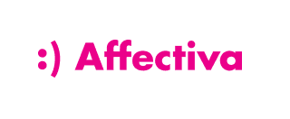

  
## Copyright (c) 2016-17 Affectiva Inc. 
The Affdex SDK is covered by our [SDK License Agreement](http://developer.affectiva.com/sdklicense)<br/>
The AffdexMe app is covered by the MIT license.  See the file [license.txt](license.txt) for copying permission.

*****************************

**AffdexMe** is an app that demonstrates the use of the Affectiva Mac OS X SDK.  It uses the camera on your Mac to view, process and analyze live video of your face. Start the app and you will see your face on the screen and metrics describing your expressions.

For developer documentation, sample code, and other information, please visit our website:
http://developer.affectiva.com

The SDK License Agreement is available at:
http://developer.affectiva.com/sdklicense

This is an Xcode 7 project.

In order to use this project, you will need to:
- Obtain the Affectiva OSX SDK (visit http://developer.affectiva.com/macos)
- Have a valid CocoaPods installation on your machine
- Install the Affdex SDK on your machine using the Podfile:
```
pod install
```

- Open the Xcode workspace file AffdexMe-OSX.xcworkspace -- not the .xcodeproj file.
- Build the project.
- Run the app and smile!
